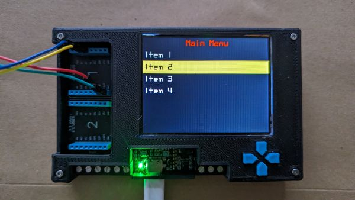

# Meadow.ProjectLab.Extensions2

Based upon the Meadow.Foundation project sample, **MicroLayoutMenu**.  
This implments a Multi-level Menu System with menu Up/Down as well as [Select] _(choose item and move to next menu level)_ and [Back] _(go back one menu level)_.

  
**_The WILDERNESS LABS Project Lab V3 board_**

## Links

- Previous repository: [Meadow.ProjectLab.Extensions](https://github.com/djaus2/Meadow.ProjectLab.Extensions)
- Original Meadow.ProjectLab [MicroLayoutMenu Project](https://github.com/WildernessLabs/Meadow.ProjectLab.Samples/tree/main/Source/MicroLayoutMenu)
- As previous:
  - [Blog about Meadow Project Lab](https://davidjones.sportronics.com.au/med/WildernessLabs_Project_Lab-About_Project_Lab_V3-med.html)
  - The target board:  [The Wilderness Labs project V3](https://store.wildernesslabs.co/collections/frontpage/products/project-lab-board)
  - [Meadow ProjectLab_Demo](https://github.com/WildernessLabs/Meadow.ProjectLab/tree/main/Source/)
  - [WildernessLabs/Meadow.ProjectLab](https://github.com/WildernessLabs/Meadow.ProjectLab)
  - [Meadow ProjectLab Samples](https://github.com/WildernessLabs/Meadow.ProjectLab.Samples)
  - [Meadow.Core.Samples](https://github.com/WildernessLabs/Meadow.Core.Samples)
  - [Meadow.Foundation.Grove](https://github.com/WildernessLabs/Meadow.Foundation.Grove)
  - [WildernessLabs](https://github.com/Wildernesslabs)
  - [WildernessLabs fork of MQTTnet](https://github.com/WildernessLabs/MQTTnet)

---

## Nb: Suggested update for MicroLayoutMenu

The original MicroLayoutMenu project has a bug that, if ShowMenuScreen is uncommented, the textual scxreen fails to be drawn.

- In ```MeadowApp.cs``` change:
```cs 
        public override Task Run()
        {
            ShowDemoScreen();

            //ShowMenuScreen();

            return base.Run();
        }
```
- To:  
```cs
        public override Task Run()
        {
            ShowDemoScreen();

            // Move to Menu after 5sec
            Thread.Sleep(5000);

           _screen.Controls.Clear(); // <-This IS needed!
           ShowMenuScreen();

            return base.Run();
        }
```

This implements the clearing of the Demo screen controls before the textual menu is drawn.

---

## About _(this)_ MultiMenu project

When it runs, the demo screen shows.





After a period the first level of the menu shows.


The top and bottom buttons are used to move up and down the menu. The right button is used to select an item and move to the next level. 
The left button is used to go back to the previous menu level. 
The Demo screen suggests this navigation scenario but ghe drawn buttons there aren't actionable.


When a menu item is selected, it is push onto the Stack with other data for that menu level. The menu is then cleared and the next level is drawn.
When [Back] is selected and the previous menu level is redrawn, the previous menu menu data is recovered from the Stack and the item previously selected there is reselected.


## Extensible Menu System

The menu data is held in a ```List<MenuItem>``` and is defined in ```MenuItem.cs```. The MenuData class defines the data for each menu level:

```cs
    public class MenuData
    {
        public string Title { get; set; }
        public string Items { get; set; }
    }
```

That is, there is a Title for each level as well as a CSV list of items for that level. 

To add or remove menu levels, simply add instantiated MenuData items in the ```List<MenuData>``` in ```MenuData.cs```, or remove them.
Each menu level requires a corresponding method in  ```MultiMenu.cs``` to handle the menu level of the form:

```cs
       private void Action3(object sender, EventArgs e)
        {
            int actionNo = 3;
            int index = _menu.SelectedRow;
            //Do Whatever for previous menu

            MenuData md = AppSettings.MenuDataList[actionNo];
            ShowMenuScreen(md.Title, md.Items, Action4);
        }
```

For each additional level, replace the 3 in the method code with the order for the level in the list, that is numbered from zero.
Any additional menu method need to be linked in the previous method via the last arguement in ```ShowMenuScreen()```. In the case above, the next level is ```Action4```.
Any functionality based upon a menu selection at a level would be inserted below ```//Do Whatever for previous menu``` in the next level method.
